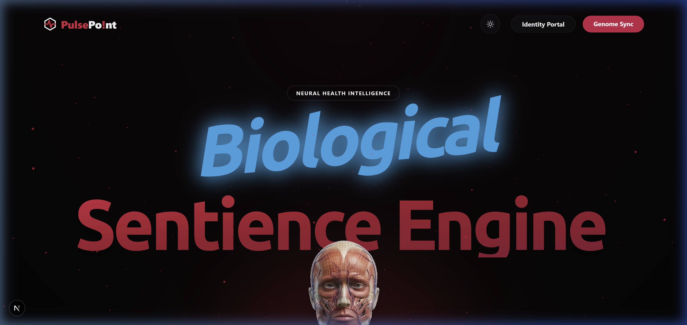
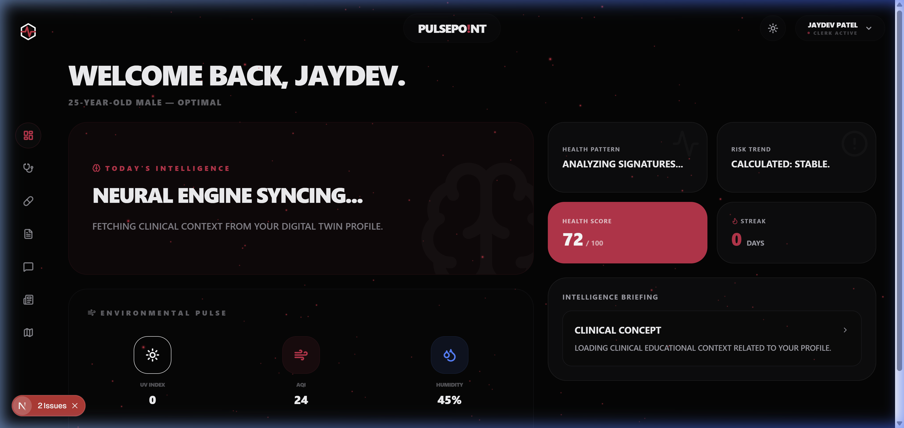
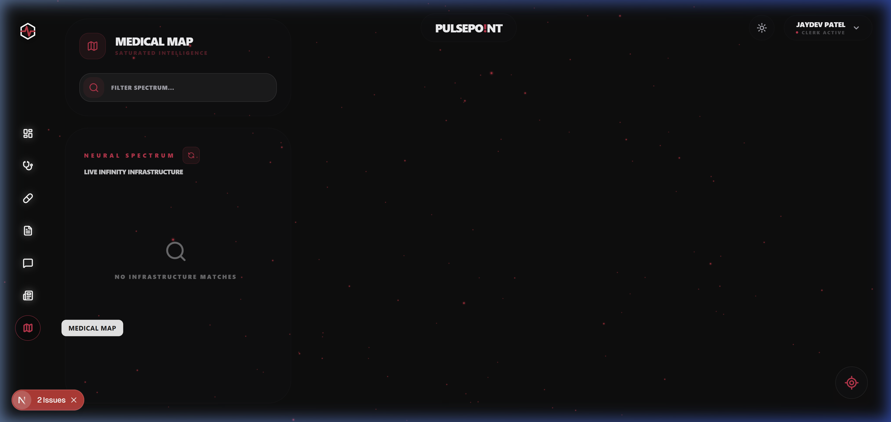
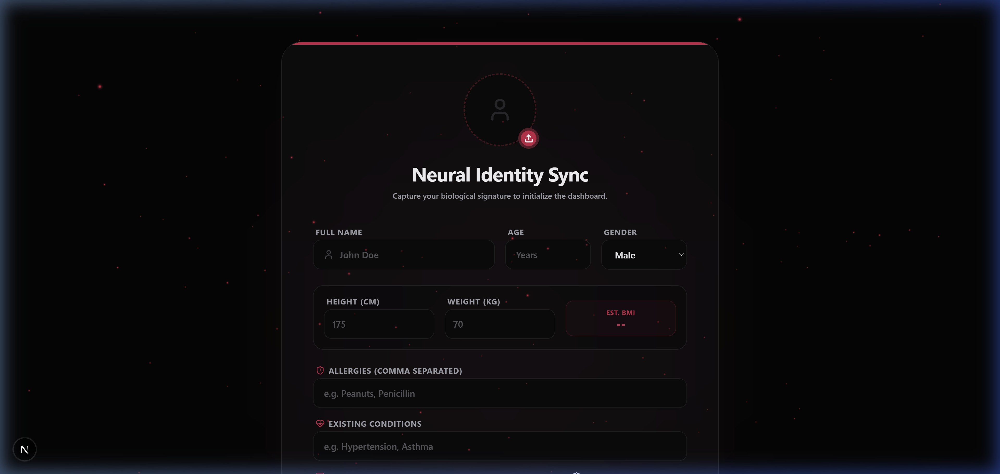

<div align="center">

  <h1>🫀 PulsePo!int</h1>
  <h3>— Neural Health Intelligence Ecosystem —</h3>

  [](https://nextjs.org/)
  [](https://clerk.com/)
  [](https://www.mongodb.com/)
  [](https://tailwindcss.com/)

  <p align="center">
    <b>PulsePo!int</b> is a premium clinical intelligence architecture designed to synchronize internal biological signatures into a high-fidelity, interactive dashboard. Built with a <b>"Neural-First"</b> design system, it delivers real-time mapping, AI-symptom triage, and secure identity orchestration.
  </p>

  [**Explore Live Hub**](#-clinical-architecture) | [**Deploy Manifest**](#-neural-setup) | [**Technical Briefing**](#-identity-handshake)

</div>

---

## 🏛️ Clinical Architecture

<div align="center">
  
</div>

### 🧬 Integrated Intelligence
The PulsePo!int ecosystem is composed of four primary intelligence nodes, each synchronized via our **Neural Middleware**:

1.  **Medical Mapping Node** — Real-time clinician-grade markers leveraging WebGL.
2.  **Symptom Intelligence** — AI-driven triage via Groq (Qwen 3-32B).
3.  **Medicine Synchronization** — Reactive cabinet tracking with neural-pulse scheduling.
4.  **Neural Identity Hub** — Clerk-powered biometric synchronization at the Edge.

---

## 📸 Neural Interface Hub

<div align="center">
  
  
  <p align="center">
    <b>Neural Intelligence Dashboard:</b> Real-time synchronization of environmental pulses and clinical briefing scores.
  </p>

  <br />

  

  <p align="center">
    <b>Medical Intelligence Map:</b> High-density marker clustering for regional clinical trend analysis.
  </p>
</div>

---

## 🔐 Identity Handshake

<div align="center">
  
</div>

PulsePo!int utilizes a **Zero-Persistence Local State** combined with **Clerk Identity Hub** for maximum clinical security. Every pulse is verified at the Edge before reaching the Neural Core.

```typescript
// PulsePoint Global Middleware Orchestration
export default clerkMiddleware((auth, request) => {
  if (isProtectedRoute(request)) {
    auth().protect(); // Synchronize Neural Lock
  }
});
```

---

## 🏗️ Neural Setup

Configure your local environment to establish the clinical link:

### [1] Backend Synchronization
| Secret Key | Clinical Purpose |
| :--- | :--- |
| `MONGODB_URI` | Central Neural Registry |
| `CLERK_SECRET_KEY` | Identity Orchestration Master |
| `GROQ_API_KEY` | Internal Symptom Triaging Engine |
| `GEMINI_API_KEY` | Forensic Document Analysis |

### [2] Deployment Protocol
1.  **Initialize Registry:** `npm install` (Root Workspace)
2.  **Synchronize Core:** `cd backend && npm run dev`
3.  **Initialize Portal:** `cd frontend && npm run dev`

---

<div align="center">
  <p><b>Clinical Excellence — PulsePo!int Neural Health Intelligence. 🔐🧪📸🏽‍⚕️</b></p>
  
</div>
