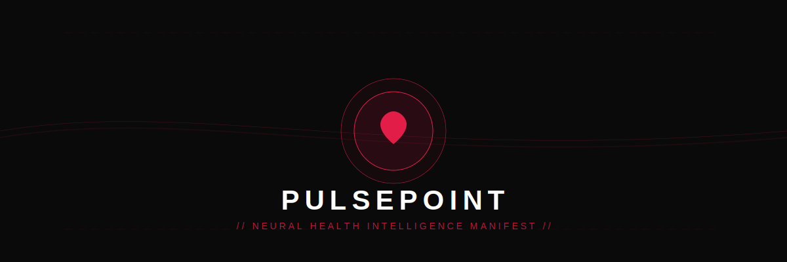
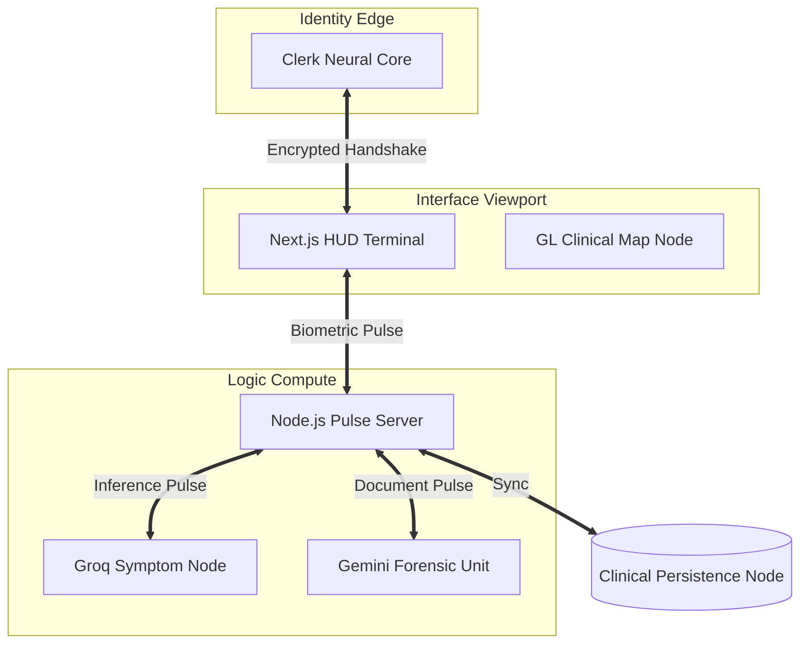
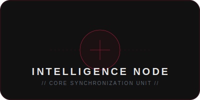

<div align="center">



<br />

[](https://nextjs.org/)
[](https://clerk.com/)
[](https://www.mongodb.com/)

---

### // SYSTEM CLASSIFICATION //
**PulsePo!int** is a high-fidelity clinical health ecosystem designed to orchestrate biological telemetry through deep-neural synchronization. Built for the next era of health forensics, it bridges reactive AI diagnostic pulses with unified identity biometrics.

[**Initialize Registry**](#-neural-protocol) | [**System Blueprint**](#-clinical-anatomy) | [**Identity Handshake**](#-identity-handshake)

</div>

---

## 🏗️ Clinical Anatomy

The PulsePo!int terminal operates on a three-tier **Neural Blueprint**, synchronizing real-time telemetry markers across edge and compute nodes:



---

## 🧬 Intelligence Nodes

The clinical kernel is modularized into four primary **Intelligence Synchronization Nodes**, each strictly isolated for high-fidelity data extraction:

<div align="center">
  <table border="0">
    <tr>
      <td align="center">
        
        <br /><b>// NODE 01: BIOMETRIC HUD //</b><br />Unified identity registry and biometric handshake.
      </td>
      <td align="center">
        
        <br /><b>// NODE 02: CLINICAL MAP //</b><br />High-density telemetry clustering and trend analysis.
      </td>
    </tr>
    <tr>
      <td align="center">
        
        <br /><b>// NODE 03: SYMPTOM ANALYZER //</b><br />Real-time diagnostic triage through neural inference.
      </td>
      <td align="center">
        
        <br /><b>// NODE 04: MEDICINE SYNC //</b><br />Reactive consistency check and scheduled pulses.
      </td>
    </tr>
  </table>
</div>

---

## 🔐 Identity Handshake

PulsePo!int utilizes a **Zero-Persistence Local State** combined with **Clerk Identity Hub** for maximum clinical security. Every pulse is verified at the Edge before reaching the Neural Core.

```typescript
// PulsePoint Global Middleware Orchestration
export default clerkMiddleware((auth, request) => {
  if (isProtectedRoute(request)) {
    auth().protect(); // Synchronize Neural Lock
  }
});
```

---

## 🔐 Neural Protocol

To establish a link with the **PulsePo!int Intelligence Registry**, synchronize the following parameters in your local environment.

### // REGISTRY PARAMETERS
| Parameter | Description | Clinical Purpose |
| :--- | :--- | :--- |
| `MONGODB_URI` | Data Persistence | Central Clinical Registry |
| `CLERK_SECRET_KEY` | Identity Link | Master Identity Handshake |
| `GROQ_API_KEY` | Symptom Inference | Primary Inferential Compute Node |
| `GEMINI_API_KEY` | Document Logic | Forensic Intelligence Node |

### // INITIALIZATION SEQUENCE
1.  **Synchronize Registry:** `npm install`
2.  **Activate Compute Node:** `cd backend && npm run dev`
3.  **Activate HUD Terminal:** `cd frontend && npm run dev`

---

<div align="center">
  <p><b>DOCUMENT CLASSIFIED // PULSEPOINT NEURAL MANIFESTO v1.3</b></p>
  <p><i>Design for the Neural Health Frontier. Strictly Optimized for Clinical Excellence.</i></p>
</div>
