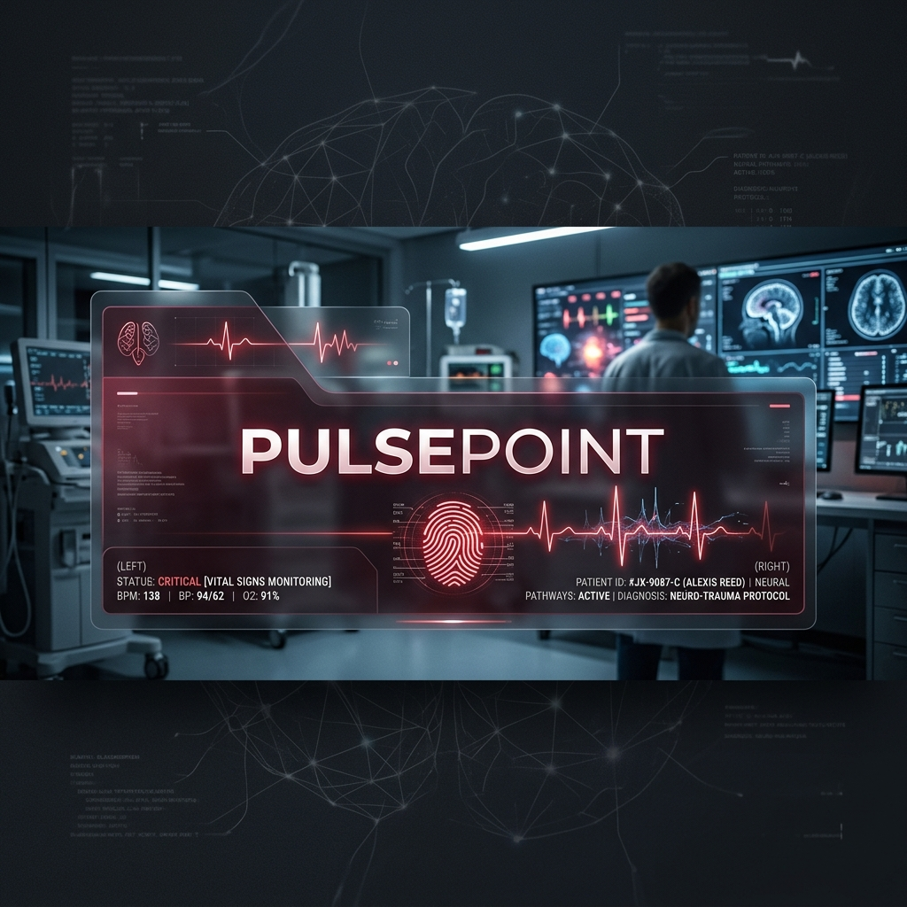
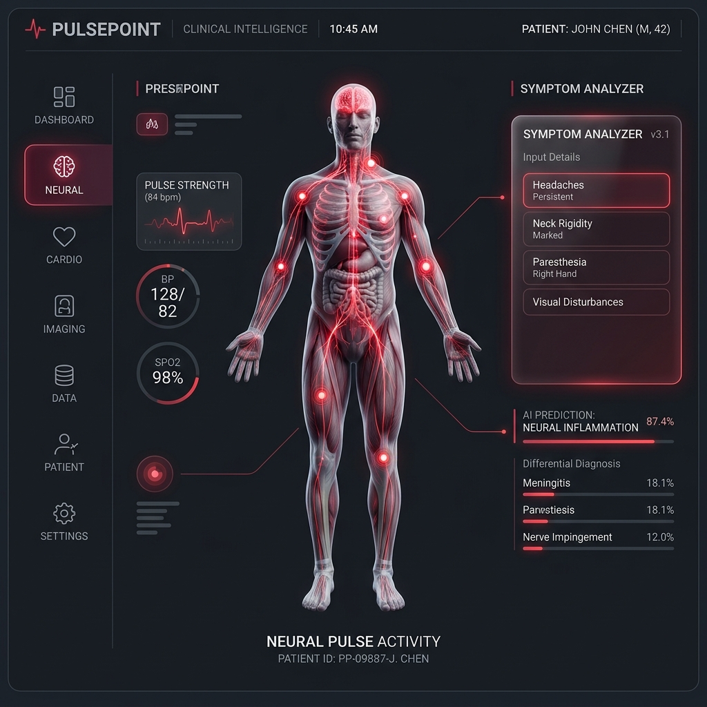

<div align="center">

  

  # 🫀 PulsePo!int
  ### — Neural Health Intelligence & Clinical Orchestration —

  [](https://nextjs.org/)
  [](https://clerk.com/)
  [](https://www.mongodb.com/)
  [](https://expressjs.com/)

  <p align="center">
    <b>PulsePo!int</b> is a high-fidelity, AI-orchestrated clinical intelligence platform designed to synchronize biological data into a unified, interactive medical dashboard. Built with a <b>"Neural-First"</b> philosophy, it combines WebGL-accelerated mapping, real-time symptom analysis, and Clerk-secured identity management.
  </p>

  [**Explore Dashboard**](#-neural-core-features) | [**Deploy to Render**](#-deployment-registry) | [**View Documentation**](#-clinical-setup)

</div>

---

## 🗺️ Neural Core Features

<div align="center">
  
</div>

| Feature | Intelligence Handshake | Aesthetic |
| :--- | :--- | :--- |
| **🗺️ Medical Map** | Real-time Overpass API + WebGL Markers | Pulse-Red HUD |
| **🧪 Symptom Analyzer** | AI-Driven Groq/Qwen 3-32B Diagnostics | Glassmorphism |
| **📸 Report Intelligence** | Gemini 2.0 Document OCR & Analysis | Neural Scan |
| **🔐 Identity Hub** | Clerk Neural Identity + Edge Middleware | Secure Bio-Link |

---

## 🚀 Deployment Registry

### [1] Backend Synchronization (Render)
Configure the following Neural Secrets in your Render dashboard:

> [!IMPORTANT]
> **Identity Sync:** Ensure the `FRONTEND_URL` exactly matches your Vercel deployment to satisfy the PulsePoint CORS handshake.

| Key | Sync Target |
| :--- | :--- |
| `MONGODB_URI` | Database Connection String (Atlas/Local) |
| `CLERK_SECRET_KEY` | Managed identity master key |
| `NEXT_PUBLIC_CLERK_PUBLISHABLE_KEY` | Identity hub public key |
| `GROQ_API_KEY` | Symptom Analysis Engine (Qwen) |
| `GEMINI_API_KEY` | Document Analysis & OCR Engine |
| `FRONTEND_URL` | Your Vercel production URL |

### [2] Frontend Synchronization (Vercel)
Configure these variables in your Vercel project settings:

| Key | Sync Target |
| :--- | :--- |
| `NEXT_PUBLIC_API_URL` | Your Render production API endpoint |
| `NEXT_PUBLIC_CLERK_PUBLISHABLE_KEY` | Public identity key |
| `CLERK_SECRET_KEY` | Master identity key |

---

## 🛠️ Clinical Setup

1. **Synchronize Dependencies:**
   ```bash
   cd backend && npm install
   cd ../frontend && npm install
   ```
2. **Launch Neural Ecosystem:**
   ```bash
   # Terminal 1: Initializing Neural Core
   cd backend && npm run dev
   # Terminal 2: Establishing Identity Portal
   cd frontend && npm run dev
   ```

---

<div align="center">
  <p><b>PulsePo!int: Neural Intelligence for Clinical Longevity. 🔐🧪📸🏽‍⚕️</b></p>
  
</div>
