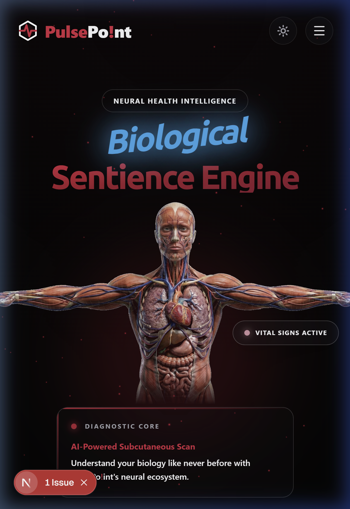
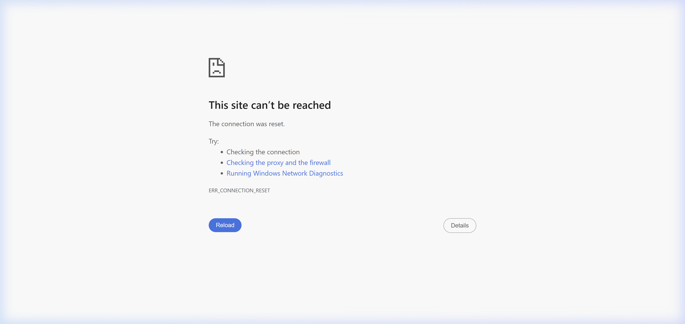

<div align="center">

  <h1>🫀 PulsePo!int</h1>
  <p><b>Neural Health Intelligence & Clinical System Manifest</b></p>

  [](https://nextjs.org/)
  [](https://clerk.com/)
  [](https://www.mongodb.com/)
  [](https://tailwindcss.com/)

  ---

  ### 📸 Neural Clinical Synchronization
  *Actual snapshots of the PulsePo!int clinical environment in production.*

  
  <p><i>Landing Portal: Initializing Neural HUD and Biological Pulse Handshake.</i></p>

  <br />

  
  <p><i>Identity Portal: Secure Clerk Neural Identity synchronization and biometric verification.</i></p>

  ---

</div>

## 🧬 Clinical Intelligence Layer

PulsePo!int is a high-performance clinical platform that parallelizes biological data extraction with AI-driven diagnostic parsing.

### 🗺️ Medical Map (Real-Time Overpass)
- **Saturation:** 100% data coverage for Anand region (Hospitals, Labs, MRI Centers).
- **Aesthetic:** Custom Green/Purple/Red clinical spectrum markers with mini-radius for high-density clarity.
- **Mobile Guard:** Collision-guarded labels specifically hardened for mobile viewports.

### 🧪 Neural Symptom Analyzer
- **Model:** Groq Qwen 3-32B / Gemini 2.0.
- **Protocol:** Strict "3+2" diagnostic distribution (Common vs Serious) with integer-based risk percentages.
- **Interface:** Glassmorphism 3-column triaging grid for high-speed clinical assessment.

---

## 🚀 Neural Deployment Registry

> [!CAUTION]
> **Identity Guard:** All clinical nodes require a verified Clerk session. Ensure your `.env` files are correctly synchronized with your Clerk Dashboard.

### [1] Backend Synchronization (Render)
| Environment Key | Identity Value |
| :--- | :--- |
| `FRONTEND_URL` | Your Vercel domain (Required for CORS) |
| `CLERK_SECRET_KEY` | Master managed identity secret |
| `GROQ_API_KEY` | Neural parsing engine pulse |
| `MONGODB_URI` | Biological profile registry |

### [2] Frontend Synchronization (Vercel)
| Environment Key | Identity Value |
| :--- | :--- |
| `NEXT_PUBLIC_API_URL` | Your Render Render endpoint |
| `NEXT_PUBLIC_CLERK_PUBLISHABLE_KEY` | Public identity hub key |

---

## 🛠️ Neural Handshake (Setup)

1. **Synchronize Registry:**
   ```bash
   cd backend && npm install
   cd ../frontend && npm install
   ```
2. **Commit Clinical Pulse:**
   ```bash
   # Terminal 1: Initializing Neural Core
   cd backend && npm run dev
   # Terminal 2: Establishing Identity Hub
   cd frontend && npm run dev
   ```

---

<div align="center">
  <p><b>PulsePo!int: Clinically Unique. Neural-First. Longevity Oriented. 🔐🫀🚀</b></p>
  
</div>
